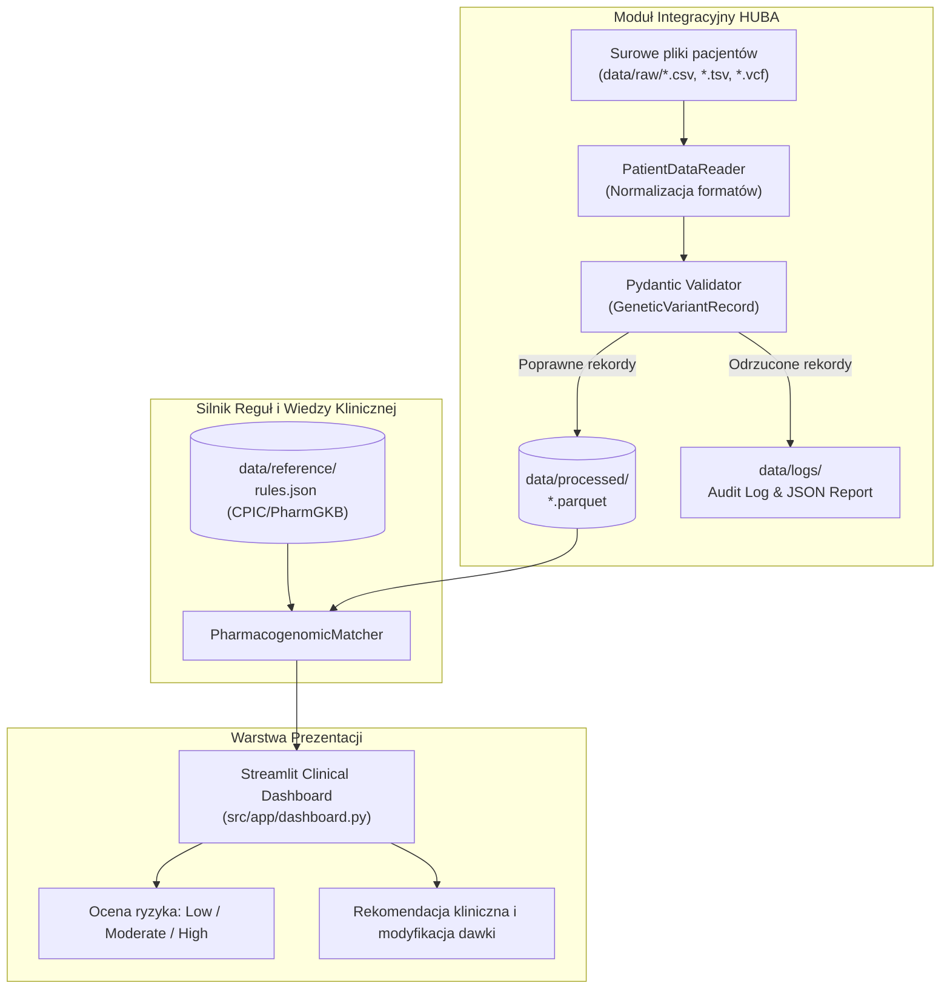

# PharmacoMatch
### System analizy interakcji lek-gen w medycynie personalizowanej

PharmacoMatch to dojrzałe architektonicznie rozwiązanie bioinformatyczne wspomagające personel medyczny w personalizacji farmakoterapii na podstawie profilu genetycznego pacjenta. System składa się z modułu integracyjnego **HUBA (Hybrid Unified Batch Analyzer)** oraz interaktywnego panelu decyzyjnego opartego o wytyczne konsorcjum **CPIC (Clinical Pharmacogenetics Implementation Consortium)** i bazy **PharmGKB**.

---

## Architektura Systemu i Przepływ Danych

System został zaprojektowany z zachowaniem ścisłej separacji warstwy integracji danych, logiki domenowej oraz warstwy prezentacji.



##  Moduł HUBA (Hybrid Unified Batch Analyzer)

Moduł HUBA stanowi inżynierski szkielet przetwarzania wsadowego (ETL) odpowiedzialny za przygotowanie heterogenicznych danych biologicznych:
* **Multi-format Reader (`reader.py`):** Bezpieczny odczyt danych tabelarycznych (`.csv`, `.tsv`) oraz wariantów w standardzie bioinformatycznym `.vcf`.
* **Rygorystyczna Walidacja (`validator.py`):** Modele Pydantic egzekwujące standard identyfikatorów polimorfizmów pojedynczego nukleotydu (`rsID` zgodny z `^rs\d+$`), czyszczenie białych znaków, sanityzację genotypów (usuwanie ukośników i standaryzacja alleli).
* **Batch Orchestration & Auditing (`pipeline.py`):** Zautomatyzowane przetwarzanie wsadowe, zapis oczyszczonych zbiorów do formatu kolumnowego Parquet oraz pełne raportowanie anomalii do plików logów.

---

##  Obsługiwane Interakcje Lek–Gen (CPIC Guidelines)

| Gen | Wariant (rsID) | Lek | Wskazanie kliniczne / Ryzyko |
|---|---|---|---|
| **CYP2D6** | `rs1065852` | **Kodeina** | Brak metabolizmu do morfiny u Poor Metabolizers (brak efektu analgetycznego). |
| **CYP2C19** | `rs4244285` | **Klopidogrel** | Brak aktywacji proleku, ryzyko powikłań sercowo-naczyniowych i zakrzepicy w stencie. |
| **SLCO1B1** | `rs4149056` | **Simwastatyna** | Upośledzony transport wątrobowy, wysokie ryzyko miopatii i rabdomiolizy. |
| **VKORC1** | `rs9923231` | **Warfaryna** | Nadwrażliwość na antykoagulanty, ryzyko ciężkich krwotoków przy standardowej dawce. |
| **DPYD** | `rs3918290` | **Fluorouracyl** | Niedobór enzymu DPD, ryzyko śmiertelnej mielotoksyczności chemioterapii. |

---

##  Instrukcja Uruchomienia

### 1. Wymagania wstępne
* Python 3.10 – 3.12
* System macOS, Linux lub Windows

### 2. Instalacja zależności
```bash
# Aktywacja środowiska wirtualnego (jeśli nieaktywne)
source .venv/bin/activate

# Instalacja pakietów
pip install -r requirements.txt

### 3. Generowanie danych wejściowych i uruchomienie HUBA
```bash
# Wygenerowanie syntetycznych profili pacjentów z brudnymi danymi
python scripts/generate_test_data.py

# Uruchomienie wsadowego pipeline'u HUBA
python run_huba.py
```

### 4. Uruchomienie testów jednostkowych
```bash
pytest -v
```

### 5. Start aplikacji klinicznej
```bash
streamlit run src/app/dashboard.py
```
Aplikacja uruchomi się automatycznie pod adresem: `http://localhost:8501`.

---

## Wykorzystanie Modeli Sztucznej Inteligencji (AI Disclosure)

Obszary, w których wykorzystano modele AI (LLM):

1. **Projektowanie Architektury i Schematów Danych:**
   * Wsparcie w opracowaniu modularnej struktury katalogów i separacji logiki integracyjnej (HUBA) od silnika decyzyjnego.
   * Modelowanie schematów walidacyjnych w Pydantic v2 pod kątem weryfikacji wariantów genetycznych.
2. **Generowanie Syntetycznych Zbiorów Danych:**
   * Wygenerowanie przypadków brzegowych dla syntetycznych pacjentów (błędne identyfikatory `rsID`, niespójne formaty zapisu genotypów, brakujące nagłówki).
3. **Dokumentacja i Wizualizacja:**
   * Wsparcie przy generowaniu diagramów przepływu danych w notacji Mermaid oraz standaryzacji komunikatów commitów wg standardu Conventional Commits.
